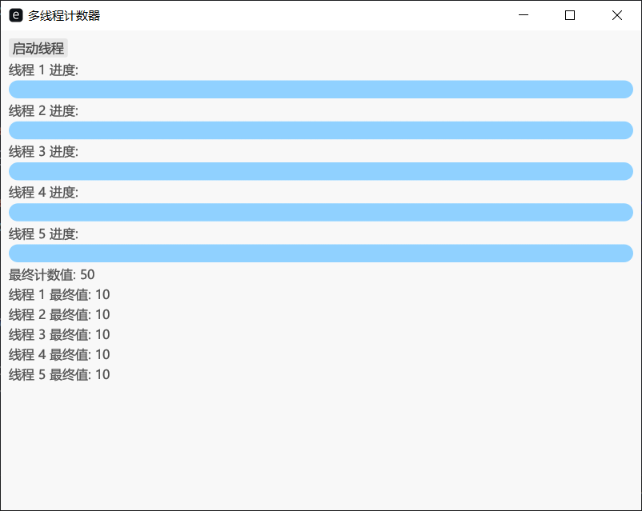

题目三：通过创建多个线程，并使用共享变量来同步线程间的操作
实验目的：理解Rust语言中进程与线程的概念，掌握多线程编程的基本方法，并观察多线程的运行机制。
背景描述：在Rust中，可以使用`std::thread`模块创建和管理线程。Rust的标准库提供了跨平台的线程支持，使得并发编程更加安全和高效。本实验将通过创建多个线程，并使用共享变量来同步线程间的操作，从而加深对多线程编程的理解。
注意事项：
1. 确保理解Rust的所有权和借用机制，这对线程安全至关重要。
2. 使用`Arc`和`Mutex`来安全地在多个线程间共享数据。
3. 确保所有线程在程序结束前正确地完成它们的工作。

实现结果:

```rust